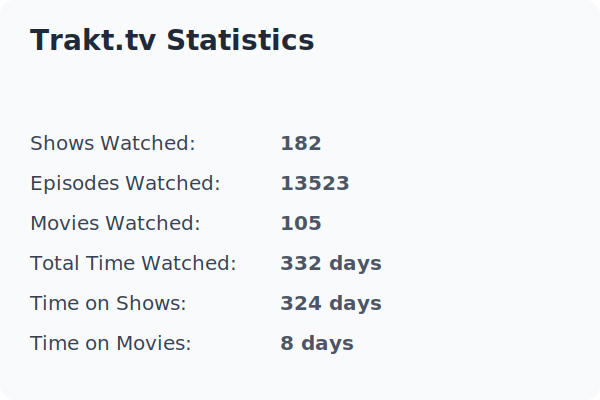

   

  

<!--START_SECTION:waka-->


**🐱 My GitHub Data** 

> 📦 115.9 kB Used in GitHub's Storage 
 > 
> 🏆 107 Contributions in the Year 2025
 > 
> 🚫 Not Opted to Hire
 > 
> 📜 76 Public Repositories 
 > 
> 🔑 13 Private Repositories 
 > 
**I'm an Early 🐤** 

```text
🌞 Morning                416 commits         ███████░░░░░░░░░░░░░░░░░░   28.83 % 
🌆 Daytime                340 commits         ██████░░░░░░░░░░░░░░░░░░░   23.56 % 
🌃 Evening                430 commits         ███████░░░░░░░░░░░░░░░░░░   29.80 % 
🌙 Night                  257 commits         ████░░░░░░░░░░░░░░░░░░░░░   17.81 % 
```
📅 **I'm Most Productive on Tuesday** 

```text
Monday                   229 commits         ████░░░░░░░░░░░░░░░░░░░░░   15.87 % 
Tuesday                  305 commits         █████░░░░░░░░░░░░░░░░░░░░   21.14 % 
Wednesday                259 commits         ████░░░░░░░░░░░░░░░░░░░░░   17.95 % 
Thursday                 133 commits         ██░░░░░░░░░░░░░░░░░░░░░░░   09.22 % 
Friday                   132 commits         ██░░░░░░░░░░░░░░░░░░░░░░░   09.15 % 
Saturday                 227 commits         ████░░░░░░░░░░░░░░░░░░░░░   15.73 % 
Sunday                   158 commits         ███░░░░░░░░░░░░░░░░░░░░░░   10.95 % 
```


📊 **This Week I Spent My Time On** 

```text
🕑︎ Time Zone: America/New_York

💬 Programming Languages: 
No Activity Tracked This Week

🔥 Editors: 
No Activity Tracked This Week

🐱‍💻 Projects: 
No Activity Tracked This Week

💻 Operating System: 
No Activity Tracked This Week
```

**I Mostly Code in Python** 

```text
Python                   16 repos            █████████████░░░░░░░░░░░░   51.61 % 
HTML                     6 repos             █████░░░░░░░░░░░░░░░░░░░░   19.35 % 
Shell                    6 repos             █████░░░░░░░░░░░░░░░░░░░░   19.35 % 
Ruby                     1 repo              █░░░░░░░░░░░░░░░░░░░░░░░░   03.23 % 
JavaScript               1 repo              █░░░░░░░░░░░░░░░░░░░░░░░░   03.23 % 
```


 Last Updated on 02/09/2025 04:05:20 UTC
<!--END_SECTION:waka-->


